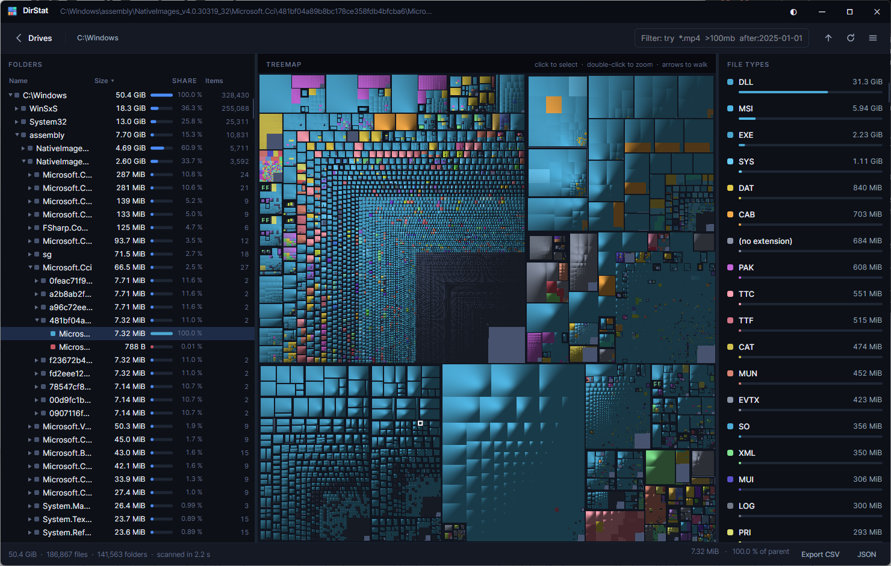

# DirStat

A disk usage analyser for Windows, macOS and Linux. It maps every byte on a volume to a
treemap you can click through, so the thing eating your disk is visible in a glance rather
than a hunt.

Feature parity with WinDirStat, QDirStat and SpaceSniffer, rebuilt on a modern rendering
stack: one self-contained executable per platform, nothing to install, no runtime to fetch.



## Why

The established tools are functionally excellent and visually stuck in 2005. They also get
sluggish on large volumes, because they draw the treemap as retained visual elements and
walk the tree on every pointer move.

DirStat keeps their capabilities and changes the engine underneath:

- **Scanning** runs across a lock-free work stack, enumerating with a struct projection that
  allocates nothing per entry beyond the node itself. Roughly **95,000 files/second** on a
  warm NTFS volume — a 187,000-file, 50 GiB `C:\Windows` scan completes in about 2 seconds.
- **The treemap is rasterized, not composed.** Layout cost is bounded by canvas pixels
  rather than by file count, so a ten-million-file scan lays out as fast as a small one.
  A 1920×1080 map takes ~18 ms to lay out and ~60 ms to rasterize, on a background thread.
- **Interaction is free.** The renderer emits an owner buffer alongside the pixels, so
  "which file is under the cursor" is one array lookup. Hover and selection are overlays;
  they never re-rasterize anything.

## Install

Download the build for your platform from [Releases](../../releases) and run it. There is
nothing else to install.

| Platform | File | Notes |
|---|---|---|
| Windows | `DirStat.exe` | x64 and arm64 |
| macOS | `DirStat.app` | x64 and arm64. Unsigned, so the first launch needs right-click → Open |
| Linux | `DirStat` | x64 and arm64. Needs `libX11`, `libICE`, `libSM` and `fontconfig`, present on every desktop install |

Or build it yourself:

```sh
git clone <this repo> && cd DirStat
./build/publish.sh          # or: pwsh ./build/publish.ps1
```

Pass `all` to build every platform at once. Output lands in `artifacts/`.

## Using it

Pick a drive, or choose any folder — several at once if you like. You can also pass paths on
the command line: `DirStat /home/me/projects`.

The results screen has three panes that stay in sync. Selecting anything in one selects it
in the other two, which is the interaction that makes this class of tool worth using.

**Folders** — sortable tree with size, share of parent and item counts. Click a column
header to sort; click it again to reverse.

**Treemap** — every file drawn proportional to its size, coloured by type, with cushion
shading so nesting stays readable. Click to select, double-click to zoom in, `Backspace` to
zoom out, arrow keys to walk the hierarchy.

**File types** — every extension in the scan, largest first.

Right-click anything for open, reveal in file manager, open terminal here, copy path,
rescan, and delete.

### Filtering

The filter box takes a small query language. Terms combine as an intersection.

| Term | Matches |
|---|---|
| `report` | names containing "report" |
| `report*.pdf` | wildcard name match, anchored to the whole name |
| `*.mp4` | files of that type |
| `>100mb` `<1gb` | size bounds — `k`, `m`, `g`, `t` suffixes |
| `after:2025-01-01` `before:2025-06-01` | modification date bounds |

So `*.mp4 >500mb after:2024-01-01` finds big, recent video files.

Filtering builds a filtered view rather than rescanning, so clearing the box restores the
full scan instantly.

### Keyboard

| Key | Action |
|---|---|
| `Enter` | Zoom into the selected folder |
| `Backspace` | Zoom out one level |
| Arrow keys | Walk the treemap |
| `Ctrl+F` | Focus the filter |
| `F5` | Rescan the selection |
| `Delete` | Move to trash |
| `Shift+Delete` | Delete permanently |

## Behaviour worth knowing

**Links are never followed.** Symlinks, junctions and mount points appear in the tree,
flagged, at zero size. Following them would both risk infinite cycles and double-count
content reachable by two paths. Their targets are counted where they really live.

**Hard links can be deduplicated**, so shared content is counted once. This is off by
default because it costs a metadata query per file, roughly halving scan throughput.

**Unreadable folders are flagged, never fatal.** The count appears in the status bar, and
their contents surface as *Unknown* space — the gap between what the volume reports as used
and what the scan could actually see.

**Cancelling still gives you results.** The partial tree is aggregated and displayed.

**Deletion goes to the platform trash** by default. On macOS and Linux this is an explicit
move into the trash folder rather than a scripted Finder call, so it does not trigger an
automation permission prompt. Linux follows the freedesktop.org trash specification, writing
the `.trashinfo` record before the move so a crash cannot orphan the file.

## Architecture

```
src/DirStat.Core        scanning, treemap layout and rasterization, filtering, export
src/DirStat.App         Avalonia views, view models, theming, shell integration
tests/DirStat.Core.Tests
```

`Core` has no UI dependency and carries the whole test suite.

A few decisions that shape everything else:

**`FileNode` stores only its own path segment**, rebuilding full paths by walking parents.
A million-node scan costs tens of megabytes rather than hundreds. Extension strings are
interned, turning millions of allocations into thousands.

**Sizes roll up in a single reverse-breadth-first pass** after the walk, rather than
interlocked adds up the parent chain during it. That trades a brief post-pass for zero
contention on the root.

**Native metadata calls self-test before they are trusted.** Unix `struct stat` layouts vary
by kernel, libc and architecture, so `NativeFs` probes a temporary file of known size and
disables the whole native path if the fields do not read back correctly. A wrong guess
degrades to a missing feature rather than to silently wrong numbers.

**Tile bounds round to nearest, not outward.** Because rounding is monotonic, one tile's
right edge lands on exactly the same pixel column as its neighbour's left edge — so adjacent
tiles neither overlap nor leave a seam, and every pixel has exactly one truthful owner.

**Grid sorting never reorders `FileNode.Children`.** The squarified layout depends on
descending size order, so the directory grid keeps its own ordering and leaves the
underlying arrays untouched.

## Development

```sh
dotnet build                                    # build everything
dotnet test                                     # 75 tests
dotnet run --project src/DirStat.App            # run it
```

The test suite covers scan aggregation, cancellation, exclusions, symlink handling,
hard-link dedup, the filter query language, size formatting, and the treemap layout
invariants: full coverage, containment, no overlap, and the pre-order emission the renderer
depends on to carry cushion surfaces down the tree.

## Licence

MIT. See [LICENSE](LICENSE).

DirStat is an independent implementation. It is not affiliated with WinDirStat, QDirStat or
SpaceSniffer, though it owes all three the debt of a good idea.
