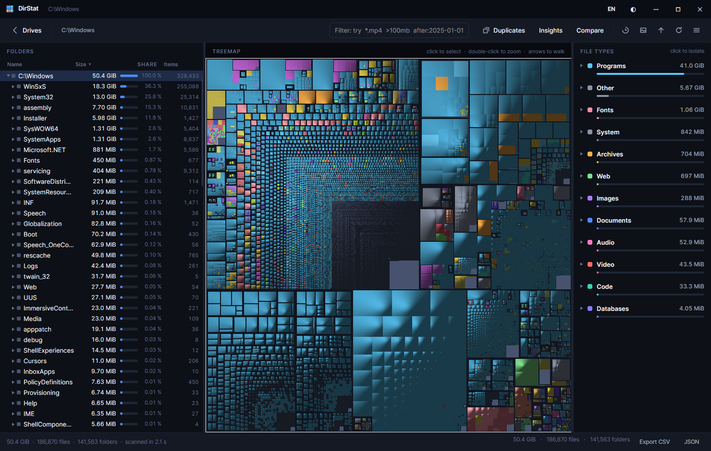
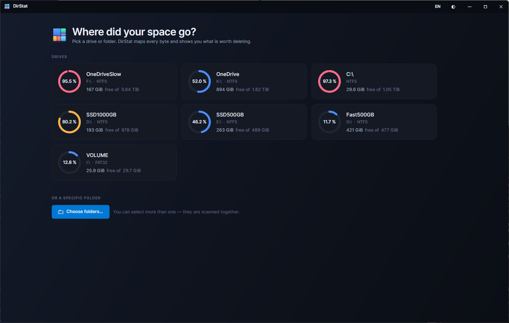
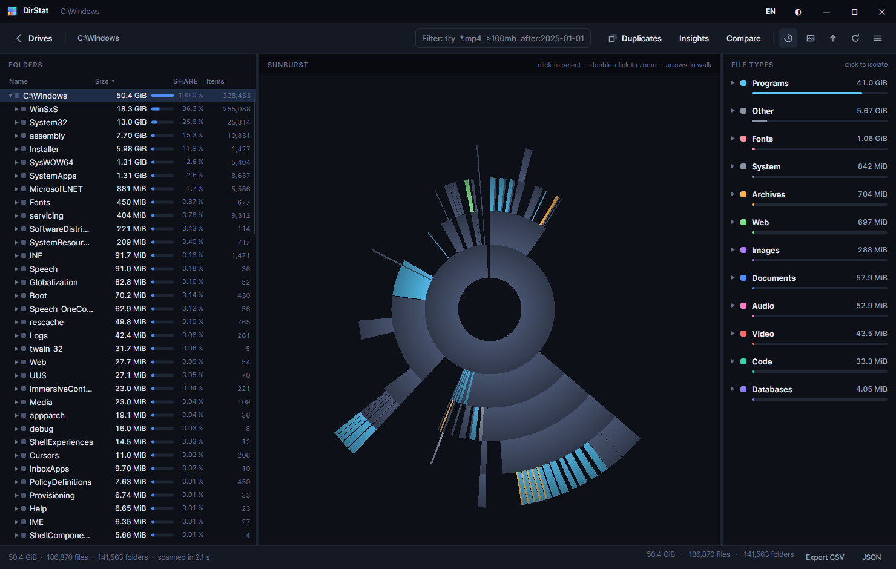
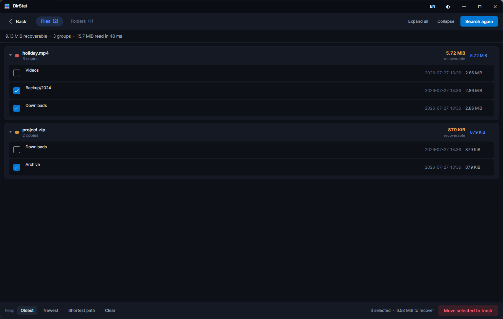
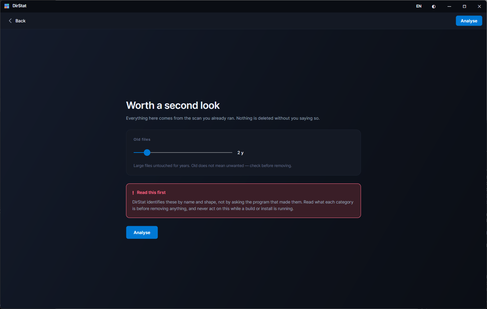
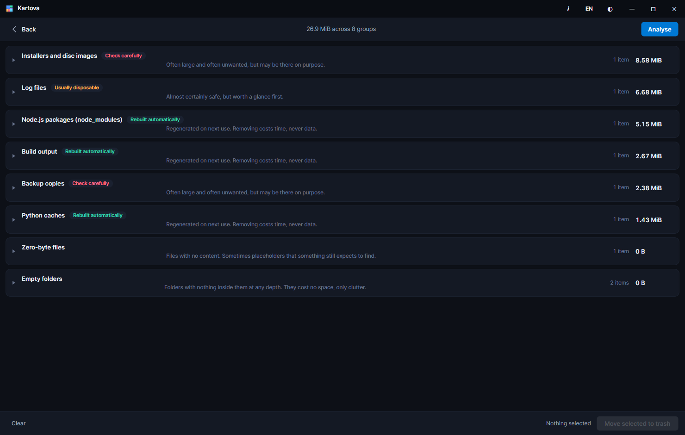

<div align="center">


# Kartova

**A disk usage analyser for Windows, macOS and Linux.**
One self-contained file per platform. Nothing to install, no runtime to fetch.

[Install](#install) · [What it does](#what-it-does) · [Command line](#command-line) · [Why](#why) · [Build](#build)

</div>

---

Kartova maps every byte on a volume to a picture you can click through, so the thing eating
your disk is visible at a glance rather than after a hunt.

It has the capabilities of WinDirStat, QDirStat and SpaceSniffer — and adds the things they
never had: a duplicate finder that compares contents, a snapshot diff that answers *what
changed*, and an insights pass that names the rebuildable clutter.



---

## Install

Download for your platform from [Releases](../../releases) and run it. There is nothing else
to install.

| Platform | File | Notes |
|---|---|---|
| Windows | `Kartova.exe` | x64 and arm64 |
| macOS | `Kartova.app` | x64 and arm64. Unsigned — first launch needs right-click → Open |
| Linux | `Kartova` | x64 and arm64. Needs `libX11`, `libICE`, `libSM`, `fontconfig` — present on every desktop install |

On Linux Kartova needs a desktop session; if `DISPLAY` and `WAYLAND_DISPLAY` are both unset it
says so and exits rather than sitting there showing nothing.

---

## What it does

### Pick a drive, or any folder

Capacity rings are graded by how full a volume is, so a disk in trouble is visible before you
read a number. Several folders can be scanned together.



**Roughly 95,000 files per second.** A 187,000-file, 50 GiB `C:\Windows` scan finishes in about
two seconds.

### Read it as a treemap or a sunburst

Every file drawn in proportion, coloured by type. The treemap uses cushion shading so nesting
stays readable; the sunburst turns depth into distance from the centre, which shows the shape
of a hierarchy in a way rectangles cannot.

Click to select, double-click to zoom, arrow keys to walk. Either view saves as a PNG.



Selecting anything in one pane selects it in all three — the interaction that makes this class
of tool worth using. File types are grouped into families, because hundreds of extensions read
as noise while a dozen families read as an answer.

### Filter with a small query language

| Term | Matches |
|---|---|
| `report` | names containing "report" |
| `report*.pdf` | wildcard, anchored to the whole name |
| `*.mp4` | files of that type |
| `>100mb` `<1gb` | size bounds — `k`, `m`, `g`, `t` suffixes |
| `after:2025-01-01` `before:2025-06-01` | modification dates |

So `*.mp4 >500mb after:2024-01-01` finds big, recent video files. Filtering builds a view
rather than rescanning, so clearing the box restores the full scan instantly.

### Find what you have twice

Contents, not names: two files match only when every byte does, two folders only when their
entire trees do. Results are ranked by recoverable space.



Apply a rule to every group at once — keep the oldest, the newest, or the copy nearest the
root — then remove the rest to the trash. **One copy of each group is always kept**; ticking
every copy is refused, because that deletes the data rather than de-duplicating it.

Reading every byte would cost more than the scan itself, so the search is staged: group by
size (free — the scan already measured everything, and different lengths cannot match), then
hash a 16 KB prefix (files that differ tend to differ early), then read in full only what is
still ambiguous. **A tree of uniquely-sized files is answered without a single read.**

Hard links are excluded. They already share their bytes, so removing one recovers nothing.

### See what is worth a second look

Stale files, folders empty all the way down, zero-byte files, and recognised rebuildable
clutter — all from data the scan already collected, so it costs one traversal and touches no
files.



This is the one screen that opens with a warning rather than a result, because a tool that
tells you what to delete is only useful if it is honest about being a guess.



Every category says what it is and how safe it is to remove:

| Badge | Meaning |
|---|---|
| **Rebuilt automatically** | Regenerated on next use. Removing costs time, never data. |
| **Usually disposable** | Almost certainly safe, but worth a glance. |
| **Check carefully** | Often large and often unwanted, but may be deliberate. |

Kartova identifies these by name and shape, not by asking the program that made them — so it
classifies and explains, and the judgement stays with you. Nothing in the list is a document,
a download, or anything you made by hand. There is no one-click purge, on purpose.

### Answer "what changed?"

Save a snapshot, then compare a later scan against it. Individual changes are ranked by
magnitude, with growth reading warm and shrinkage cool.

For something **added or removed** the outermost folder is named — "this whole folder is new"
beats a line per file inside it. For something that **grew or shrank** the innermost file is —
"this database grew by 4 GB" beats every folder above it repeating the same number.

A rename reads as one removal and one addition. Nothing on disk says they were the same thing,
and guessing would be worse than being plain about it.

### Four languages

English, German, French and Spanish, switchable from the title bar. The window retranslates
immediately; a first run follows your operating system.

### Everything else

Right-click anything for open, reveal in file manager, open terminal here, copy path, rescan,
and delete. Exclusion rules skip folder names wherever they appear. Export to CSV or JSON.
Dark and light themes.

| Key | Action |
|---|---|
| `Enter` | Zoom into the selected folder |
| `Backspace` | Zoom out |
| Arrows | Walk the chart |
| `Ctrl+F` | Focus the filter |
| `Ctrl+C` | Copy the selected path |
| `F5` | Rescan the selection |
| `Delete` / `Shift+Delete` | Trash / delete permanently |

---

## Command line

The scanner and every analysis are UI-free, so Kartova runs headless on a build agent or over
SSH with no display at all.

```sh
kartova --scan /home/me --duplicates          # scan and report duplicates
kartova --scan C:\ --snapshot --quiet         # store a snapshot for later
kartova --compare monday.kartova --scan C:\   # what changed since Monday
kartova --scan . --export report.json         # JSON, or CSV for any other extension
kartova --list-snapshots                      # what has been stored
```

```
--scan <path>          directory to scan
--export <file>        write results; .json for JSON, anything else CSV
--snapshot [file]      store the scan for later comparison
--duplicates           also report duplicate files and folders
--insights             also report stale files, empty folders and junk
--min-size <bytes>     smallest file the duplicate search considers
--exclude a,b,c        directory names to skip
--quiet                print only what was asked for
--compare a[,b]        compare two snapshots, or one against --scan
```

---

## Why

The established tools are functionally excellent and visually stuck in 2005. They also get
sluggish on large volumes, because they draw the treemap as retained visual elements and walk
the tree on every pointer move.

Kartova keeps their capabilities and changes the engine underneath:

**Scanning** runs across a lock-free work stack, enumerating with a struct projection that
allocates nothing per entry beyond the node itself.

**The chart is rasterized, not composed.** Layout cost is bounded by canvas pixels rather than
by file count, so a ten-million-file scan lays out as fast as a small one. A 1920×1080 treemap
takes ~18 ms to lay out and ~60 ms to rasterize, on a background thread.

**Interaction is free.** The renderer emits an owner buffer alongside the pixels, so "which
file is under the cursor" is one array lookup. Hover and selection are overlays; they never
re-rasterize anything.

A few decisions that shape the rest:

- **`FileNode` stores only its own path segment**, rebuilding full paths by walking parents. A
  million-node scan costs tens of megabytes rather than hundreds. Extension strings are
  interned, turning millions of allocations into thousands.
- **Sizes roll up in one reverse-breadth-first pass** after the walk rather than interlocked
  adds up the parent chain during it — zero contention on the root.
- **Native metadata calls self-test before they are trusted.** Unix `struct stat` layouts vary
  by kernel, libc and architecture, so `NativeFs` probes a temporary file of known size and
  disables the whole native path if the fields do not read back correctly. A wrong guess
  degrades to a missing feature rather than to silently wrong numbers.
- **Tile bounds round to nearest, not outward.** Because rounding is monotonic, one tile's
  right edge lands on exactly the same pixel column as its neighbour's left edge — adjacent
  tiles neither overlap nor leave a seam, and every pixel has one truthful owner.
- **Links are never followed.** Symlinks, junctions and mount points appear in the tree,
  flagged, at zero size. Following them would risk cycles and double-count content reachable
  by two paths.
- **Unreadable folders are flagged, never fatal**, and surface as *Unknown* space — the gap
  between what the volume reports as used and what the scan could see.
- **Cancelling still gives you results.** The partial tree is aggregated and displayed.
- **Deletion goes to the platform trash.** On macOS and Linux that is an explicit move into
  the trash folder rather than a scripted Finder call, so it does not trigger an automation
  permission prompt. Linux follows the freedesktop.org specification, writing the `.trashinfo`
  record before the move so a crash cannot orphan the file.

---

## Build

```
src/Kartova.Core        scanning, layout, rasterization, duplicates, insights, snapshots
src/Kartova.App         Avalonia views, view models, theming, shell integration, CLI
tests/Kartova.Core.Tests
```

`Core` has no UI dependency and carries the whole test suite.

```sh
dotnet build                              # build everything
dotnet test                               # 200 tests
dotnet run --project src/Kartova.App      # run it

./build/publish.sh                        # self-contained, host platform
./build/publish.sh all                    # all six platforms → artifacts/
./build/publish.sh all package            # plus archives and SHA256SUMS.txt
```

`pwsh ./build/publish.ps1` does the same on Windows. One machine can emit all six targets,
because .NET cross-publishes — but a build for a platform is not evidence it runs there, so
each one is tested on the platform it targets before release.

The suite covers scan aggregation, cancellation, exclusions, symlink and hard-link handling,
volume enumeration, the filter query language, duplicate detection including folder matching
and nested suppression, snapshot round-trips, comparison semantics, junk classification, size
formatting, translation-catalogue parity, and the layout invariants for both charts: full
coverage, containment, no overlap, the sunburst ending exactly on its radius whatever shape of
tree it is given, and the pre-order emission the treemap renderer depends on to carry cushion
surfaces down the tree.

---

## Licence

Made by **Markus Furtlehner**. MIT — see [LICENSE](LICENSE). Free to use, change and share.

The name is from cartography — *Karte*, *carte*, *carta*, *chart*. Kartova draws two kinds of
map of the same disk, and you read whichever one answers your question faster.

The icon is generated, not drawn: `python build/make_icons.py` renders it from the app's own
accent ramp using nothing but the Python standard library, so there is no third-party artwork
anywhere in the tree.

Kartova is an independent implementation. It is not affiliated with WinDirStat, QDirStat or
SpaceSniffer, though it owes all three the debt of a good idea.
